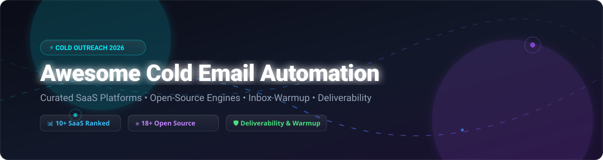

# Awesome Cold Email Automation 🚀

  
  
  
  
  

---

## 📌 Executive Overview & Ecosystem Guide

Welcome to the **Curated Ecosystem Guide for Cold Email Automation, Automated Mailbox Warmup, Inbox Rotation & Sales Outreach Engineering**. 

Whether you are an enterprise sales team scaling outbound revenue, a growth marketing agency managing 100+ client domains, or an engineer self-hosting custom SMTP deliverability infrastructure without per-seat SaaS costs, this list provides an authoritative comparison of top **SaaS Outreach Platforms** and **Production-Ready Open-Source GitHub Repositories**.

---

## 📚 Table of Contents
- [🏢 SaaS & Hosted Outreach Platforms](#-saas--hosted-outreach-platforms)
- [💻 Open-Source GitHub Projects](#-open-source-github-projects)
  - [⚡ Full Automation Platforms & Infrastructure](#-full-automation-platforms--infrastructure)
  - [🤖 AI SDR Agents & Outbound Workflows](#-ai-sdr-agents--outbound-workflows)
  - [📩 Sending SDKs & Warmup Utilities](#-sending-sdks--warmup-utilities)
- [🤝 How to Contribute](#-how-to-contribute)
- [📈 Star History](#-star-history)
- [💖 Support & Community](#-support--community)
- [⚠️ Disclaimer](#️-disclaimer)

---

## 🏢 SaaS & Hosted Outreach Platforms

> 📊 **Sector Market Size & Dynamics**: The global B2B Sales Engagement & Cold Email Automation software market is estimated at **~$2.1 Billion** in 2026 (projected to expand to **$5.4 Billion** by 2032). The sector is **moderately fragmented** with low barrier to entry for basic senders, undergoing rapid product consolidation around deliverability algorithms, automated inbox rotation, unified master inboxes, and autonomous AI SDR agents.

| Platform / Tool 🚀 | Estimated ARR / Size 💼 | Starting Tier Price 💰 | Free Tier / Trial Limits 🎁 | Key Features & Core Positioning ⚡ |
| :--- | :--- | :--- | :--- | :--- |
| **[lemlist](https://lemlist.com/)** | **~$60M ARR** ($150M valuation) | `$39/month` (Email Starter) | 14-day free trial *(No credit card required)* | Multichannel sequences (Email + LinkedIn), dynamic image/landing page personalization, built-in Lemwarm warmup engine. |
| **[Instantly.ai](https://instantly.ai/)** | **~$40M ARR** (Bootstrapped) | `$37/month` (Growth Plan) | 14-day free trial *(Full access to features)* | Unlimited sending accounts, automated inbox rotation, master inbox, high-volume agency infrastructure. |
| **[Snov.io](https://snov.io/)** | **~$25M ARR** (Bootstrapped) | `$30/month` (Starter Plan) | **Free Forever Plan** *(50 credits/mo, 100 recipients/mo)* | All-in-one platform with email finder, email verifier, drip outreach campaigns, and lightweight CRM. |
| **[Reply.io](https://reply.io/)** | **~$14.7M ARR** | `$49/user/mo` (Starter) | 14-day free trial *(plus Free Plan with 200 credits/mo)* | AI SDR agent (Jason.ai), multichannel outreach (Email, LinkedIn, Phone), meeting booking automation. |
| **[Smartlead](https://smartlead.ai/)** | **~$14M ARR** (Bootstrapped) | `$39/month` (Basic Plan) | 14-day free trial *(Unlimited email accounts)* | Master inbox, white-label agency dashboard, automated deliverability protection, unlimited mailbox rotation. |
| **[Woodpecker](https://woodpecker.co/)** | **~$11.6M ARR** | `$29/month` (Cold Email) | 7-day free trial *(Send up to 50 cold emails)* | B2B cold email tool with condition-based sequences, adaptive send rates, and spam detection alerts. |
| **[GMass](https://gmass.co/)** | **~$8.6M ARR** (Bootstrapped) | `$25/month` (Standard Plan) | **Free Forever Plan** *(Send up to 50 emails/day)* | Native Gmail/Google Workspace mail merge extension with automated follow-ups and click tracking. |
| **[QuickMail](https://quickmail.com/)** | **~$2.8M ARR** (Bootstrapped) | `$49/month` (Basic Plan) | 14-day free trial *(Up to 1,000 emails/mo)* | Built for agencies & consultants; features primary/secondary inbox rotation and automated follow-up sequences. |
| **[Mailshake](https://mailshake.com/)** | **~$2.4M ARR** | `$58/month` (Email Outreach) | 30-day money-back guarantee *(7-day trial)* | Sales engagement platform for cold email, phone dialer integration, and LinkedIn social outreach tasks. |
| **[YAMM](https://yamm.com/)** | **~$2.0M ARR** | `$25/year` (~`$2.08/mo`) | **Free Forever Plan** *(50 emails/day Gmail, 400/day Workspace)* | Spreadsheet-driven mail merge add-on for Google Sheets with real-time open and bounce tracking. |

---

## 💻 Open-Source GitHub Projects

Below is a comprehensive collection of active open-source cold email platforms, deliverability SDKs, AI outbound agents, and mail merge frameworks. Ranked in descending order by **GitHub Stars_Count**.

---

### ⚡ Full Automation Platforms & Infrastructure

* **[Activepieces](https://github.com/activepieces/activepieces)**   
  *Open-source no-code business automation & workflow engine.* Integrates natively with Smartlead, Instantly, Lemlist, and Apollo to automate complex cold outreach sequences, CRM updates, and lead scoring. *License: MIT / AGPLv3.*

* **[listmonk](https://github.com/knadh/listmonk)**   
  *High-performance open-source newsletter and cold outreach engine written in Go.* Handles multi-million message queues with low CPU/memory overhead, custom tracking domains, template rendering, and SQL-backed subscriber segmentation. *License: AGPLv3.*

* **[Postal](https://github.com/postalserver/postal)**   
  *Fully featured open-source mail delivery platform for incoming and outgoing mail.* Replaces SendGrid/Mailgun with your own IP pools, DKIM signing, MX routing, webhook delivery events, and SMTP relay servers. *License: MIT.*

* **[Mautic](https://github.com/mautic/mautic)**   
  *World's largest open-source marketing automation platform.* Provides automated drip email sequences, lead tracking, campaign builders, and lead scoring for self-hosted sales teams. *License: GPLv3.*

* **[Warmbly](https://github.com/warmbly/warmbly)**   
  *The largest open-source B2B cold outreach & email warmup platform.* Apache 2.0 license. Features multi-step sequences, shared analytics, and mailbox warmup using a network of real monitored mailboxes with automatic spam rescue. Zero cloud dependencies with one-command installation. *License: Apache 2.0.*

* **[Meteor Emails](https://github.com/catin-black/meteor-emails)**   
  *Free and open-source cold email outreach engine designed to eliminate sales stagnation.* Allows sending customized multi-step sequences with zero subscription fees. *License: MIT.*

* **[Linki](https://github.com/moaljumaa/linki)**   
  *Self-hosted AI SDR for multichannel outreach (LinkedIn + Email).* Features server-side headless LinkedIn login, Sales Navigator extraction, unified inbox, and mailbox ramp-up routines. *License: AGPLv3.*

* **[DarkzWarmer](https://github.com/darkzOGx/darkzwarmer)**   
  *Self-hosted email warmup network.* Features cross-domain warmup on a 28-day ramp with human-delayed auto-replies over IMAP or Resend inbound with provider-agnostic SMTP support. *License: MIT.*

* **[Pigeon](https://github.com/tarinagarwal/Pigeon)**   
  *Open-source cold email outreach & deliverability platform.* Multi-step campaigns, per-step delays, A/B testing with automated winner selection, Gmail/SMTP inbox rotation, pairing risk scoring, and DNS automation (SPF, DKIM, DMARC). Tech stack: Next.js 16, TypeScript, MongoDB. *License: MIT.*

* **[Emareach](https://github.com/ritik-prog/emareach)**   
  *Production-grade open-source AI email marketing platform.* Warmup with LLM-generated threads, spam-to-inbox recovery, SPF/DKIM validation, contact enrichment, and custom tracking domains. Tech stack: FastAPI (Python 3.12), Next.js 16, MongoDB, Docker. *License: MIT.*

---

### 🤖 AI SDR Agents & Outbound Workflows

* **[Cold Outbound Skills](https://github.com/growthenginenowoslawski/coldoutboundskills)**   
  *Open-source Claude Code skills for cold email and outbound sales.* Grade outreach campaigns, export Prospeo searches, scrape Google Maps, and generate hyper-personalized copy directly inside Claude Code. *License: MIT.*

* **[Email-automation](https://github.com/PaulleDemon/Email-automation)**   
  *Lightweight open-source cold email outreach automation script.* Handles mailing lists, variable substitution, and automated dispatch via custom SMTP parameters. *License: MIT.*

* **[GenAI Cold Email Generator](https://github.com/codebasics/project-genai-cold-email-generator)**   
  *LLM-powered cold email generation tool built with Llama 3.1, LangChain, ChromaDB, and Streamlit.* Scrapes job portal URLs, extracts company tech stacks, and crafts personalized pitch emails. *License: MIT.*

* **[Harvey](https://github.com/ethanplusai/harvey)**   
  *Autonomous AI sales agent powered by Claude Code.* Automatically discovers prospects, drafts tailored cold emails, triggers campaigns, and handles inbound responses. *License: MIT.*

* **[gtm-mcp](https://github.com/impecablemee/gtm-mcp)**   
  *Open-source B2B cold outreach pipeline built for Claude Code.* Orchestrates lead discovery (Apollo), AI classification, contact extraction, and SmartLead campaign pushing via stdio transport. *License: MIT.*

* **[free_outbound_agent](https://github.com/Dumebii/free_outbound_agent)**   
  *Open-source AI outbound agent.* Finds prospects on GitHub & Dev.to, generates personalized messages with Claude or GPT-4, and sends via standard SMTP. Includes semi-automated LinkedIn messaging queue. *License: MIT.*

* **[Cold Outreach Agent](https://github.com/jordan-jakisa/cold-outreach-agent)**   
  *Simple Streamlit cold outreach application.* Uses GPT-3.5 and smtplib to generate and dispatch personalized cold sales emails based on CSV recipient inputs. *License: MIT.*

* **[Automated Outreach Pipeline](https://github.com/AnanyaGubba/Automated-Outreach-Pipeline)**   
  *Autonomous 4-stage cold outreach pipeline written in Python 3.13.* Performs lookalike company search (Ocean.io), contact discovery (Prospeo), email resolution (Eazyreach), and sending (Brevo). *License: MIT.*

---

### 📩 Sending SDKs & Warmup Utilities

* **[elxmail](https://www.npmjs.com/package/elxmail)**  
  *Cold email sending SDK for Node.js.* Features intelligent send spacing, DNS verification (SPF/DKIM/DMARC/rDNS), content spam scoring (0-100), auto-suppression management, and domain analytics.

---

## 🤝 How to Contribute

Contributions are warmly welcomed! Help keep this repository the definitive resource for sales outreach engineers:

1. **Fork the Repository** to your GitHub account.
2. **Add or Edit Entries** in `README.md` following the established table & list markdown format.
3. **Ensure Links & Stars_Badges** follow the exact `https://img.shields.io/github/stars/owner/repo?style=social` formatting.
4. **Submit a Pull Request** with a concise description of your changes.

---

## 📈 Star History

---

## 💖 Support & Community

Thank you for exploring **Awesome Cold Email Automation**! If this repository helps you build better deliverability infrastructure or streamline your cold outreach campaigns:

* ⭐ **Star this repository** to stay updated on new tools and deliverability research.
* 🔀 **Fork & Share** with fellow founders, sales engineers, and growth marketers.
* ☕ **Support Maintenance**: Consider supporting ongoing updates via the [GitHub Sponsors Dashboard](https://github.com/sponsors/ishandutta2007).

---

## ⚠️ Disclaimer

This repository is a community-curated collection intended for educational and research purposes. Cold email platforms process sensitive prospect data; users must comply with CAN-SPAM, GDPR, CCPA, and relevant anti-spam regulations when configuring cold outreach infrastructure.
